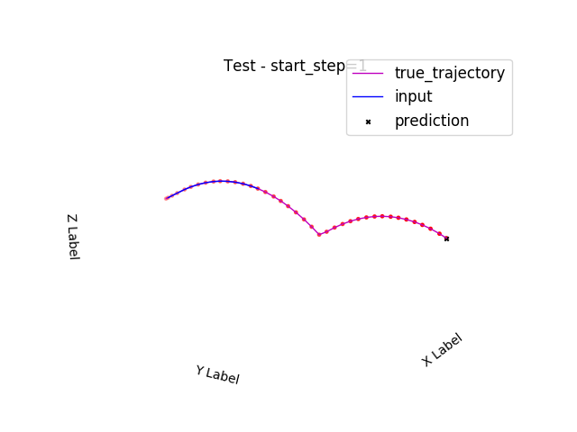
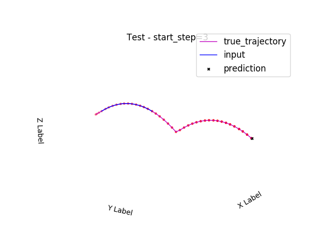
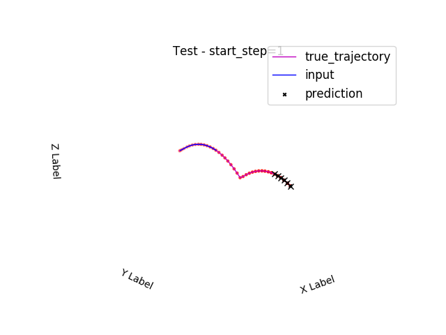
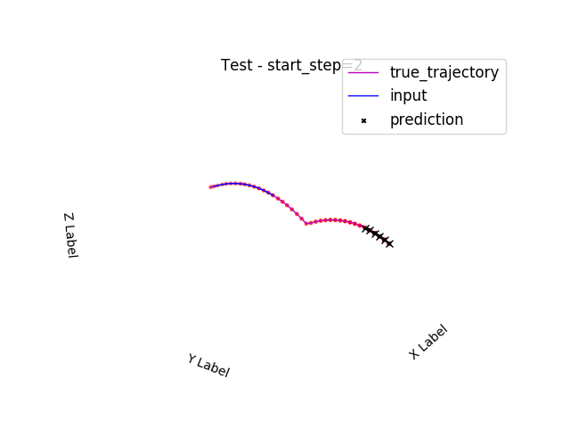
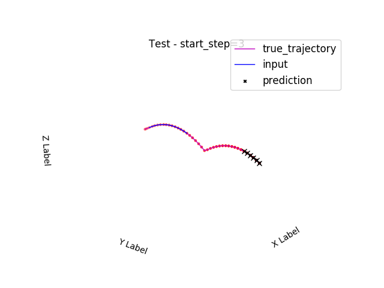

# Table Tennis Ball Prediction


Implementation of **Highway network + LSTM + MDN** to perform prediction of flying table tennis ball

---

**Input**:

Intial several camera views of flying table tennis

**Output**:

Ball's position in a single future frame or several future frames

---


**Given** a user-specified number of initial frames of camera **images** of flying table tennis ball, the algorithm here can **predict** the cartesian coordinate of **table tennis ball** in the future frames in the world coordinate system. 

For example, after training, the algorithm can predict the position of table tennis ball 33 frames later after it received the initial 14 frames of table tennis ball flying camera views. That's to say, after a table tennis ball is served, a camera will be recording visual images of this scene periodically (30 Hz). And the algorithm can predict the ball position in the 47th (14 + 33) frames, i.e., the ball's position after 1.6s since it's launched. Based on the prediction, the robot will be able to kick back the ball.

The algorithm is able to accurately predict the future (like 33 frames later) ball's position based on the initial 14 consecutive camera views. Plus, it can also **predict ball's position in several future frames** (like future 8 frames) **simultaneously** based on these 14 initial frames, i.e., ball's positions in 40th to 47th frames.

---

**Single-Frame Prediction**:

Input starting frame=1:



Input starting frame=2:


Input starting frame=3:




**Multi-Frames Prediction**:

Input starting frame=1:



Input starting frame=2:



Input starting frame=3:




---

## Package Requirements:
* [TensorFlow 1.0](https://www.tensorflow.org/install/install_linux)
```bash
pip install tensorflow-gpu
```

* [TensorLayer](http://tensorlayer.readthedocs.io/en/latest/)
```bash
pip install git+https://github.com/zsdonghao/tensorlayer.git
```
* [sklearn](http://scikit-learn.org/)
```bash
pip install scikit-learn
```

---

## Run
```bash
cd scripts
python main.py
```

**Single frame prediction training**:
```bash
python main.py -fd 4 --num_cells=2 -wd=0.00013 -sl=14 --keep_prob=0.75
```

**Testing**:
```bash
python main.py -fd 4 --num_cells=2 -wd=0.00013 -sl=14 --keep_prob=0.75 --test
```

**Multiple frames prediction training**:
```bash
python main.py --train_condition=multiframe_pred -fd=4 --num_cells=2 -wd=0.00013 -sl=14 --keep_prob=0.75
```

**Testing**:
```bash
python main.py --train_condition=multiframe_pred -fd=4 --num_cells=2 -wd=0.00013 -sl=14 --keep_prob=0.75 --test
```

### Control UR robot

First, compile UR ROS package:
```bash
cd <path_to_HLM-Pred>/pingpong-simulation
catkin_make
```
Put `ping_pong_ball` and `table` folders in `model` folder into `~/.gazebo/models`.

Also, change the computer name in `pingpong-simulation/src/pingpang_gazebo/worlds/table_tennis.world`: `[<uri>file:///home/...]`

```bash
gedit ~/.bashrc
```
Add `source <path_to_HLM-Pred>/pingpong-simulation/devel/setup.bash` to the end of `bashrc`

To launch the table tennis environment, run:
```bash
roslaunch pingpang_gazebo pingpang_AI.launch
```

Then, run the prediction script in `<path_to_HLM-Pred>/scripts`

**Single frame prediction**:
```bash
cd <path_to_HLM-Pred>/scripts/
python main.py --train_condition=real_time_play -fd 4 --num_cells=2 -wd=0.00013 -sl=14 --keep_prob=0.75
```

**Multiple frame prediction**:
```bash
python main.py --train_condition=real_time_play -fd=4 --num_cells=2 -wd=0.00013 -sl=14 --keep_prob=0.75 -md
```

These are just example usages, modify the arguments according to your own needs.

After this, make UR robot play table tennis by running:
```bash
cd <path_to_HLM-Pred>/pingpong-simulation/src/pingpang_control/scripts
python play_table_tennis.py
```


## Optional arguments to pass in when run main.py
```bash
usage: main.py [-h]
               [--train_condition {toy_test,coordinate_input,center_pixel_input,real_time_play,multiframe_pred}]
               [--train_dir TRAIN_DIR] [--restore_training]
               [--restore_step RESTORE_STEP] [--test] [--rnn_cell {lstm,gru}]
               [--num_cells NUM_CELLS] [--num_mixtures NUM_MIXTURES]
               [--seq_length SEQ_LENGTH] [--gaussian_dim GAUSSIAN_DIM]
               [--features_dim FEATURES_DIM] [--weight_decay WEIGHT_DECAY]
               [--learning_rate LEARNING_RATE] [--batch_size BATCH_SIZE]
               [--num_epochs NUM_EPOCHS] [--keep_prob KEEP_PROB]
               [--grad_clip GRAD_CLIP] [--random_seed RANDOM_SEED]
               [--ckpt_interval CKPT_INTERVAL]
               [--predicted_step PREDICTED_STEP]
               [--pred_frames_num PRED_FRAMES_NUM] [--multi_pred]

Run the Table Tennis Ball Prediction algorithm.

optional arguments:
  -h, --help            show this help message and exit
  --train_condition {toy_test,coordinate_input,center_pixel_input,real_time_play,multiframe_pred}, 
  -tc {toy_test,coordinate_input,center_pixel_input,real_time_play,multiframe_pred}
                        train_condition: 'toy_test', 'coordinate_input',
                        'center_pixel_input','multiframe_pred' or
                        'real_time_play'
  --train_dir TRAIN_DIR
                        path to the training directory.
  --restore_training, -rt
                        restore training
  --restore_step RESTORE_STEP, -rs RESTORE_STEP
                        checkpoint file to restore
  --test                run algorithm in testing mode
  --rnn_cell {lstm,gru}
                        type of rnn cell: 'lstm' or 'gru'
  --num_cells NUM_CELLS
                        number of rnn cells
  --num_mixtures NUM_MIXTURES
                        number of mixtures for MDN
  --seq_length SEQ_LENGTH, -sl SEQ_LENGTH
                        sequence length
  --gaussian_dim GAUSSIAN_DIM, -gd GAUSSIAN_DIM
                        dimentionality of gaussian distribution
  --features_dim FEATURES_DIM, -fd FEATURES_DIM
                        dimentionality of input features
  --weight_decay WEIGHT_DECAY, -wd WEIGHT_DECAY
                        scale factor of regularization of neural network
  --learning_rate LEARNING_RATE, -lr LEARNING_RATE
                        learning rate
  --batch_size BATCH_SIZE
                        minibatch size
  --num_epochs NUM_EPOCHS
                        number of epochs
  --keep_prob KEEP_PROB
                        dropout keep probability
  --grad_clip GRAD_CLIP
                        clip gradients at this value
  --random_seed RANDOM_SEED
                        random seed
  --ckpt_interval CKPT_INTERVAL
                        checkpoint file save interval
  --predicted_step PREDICTED_STEP, -ps PREDICTED_STEP
                        which time step after the last sequence input to make
                        prediction
  --pred_frames_num PRED_FRAMES_NUM, -pfn PRED_FRAMES_NUM
                        if predicting multiple frames, how many frames to
                        predict
  --multi_pred, -md     if in real_time_play mode, choose whether to predict
                        single frame or multiple frames

```


## Training Result:

**Single frame prediction**: given 14 initial camera frames, predict the position of table tennis ball in the 33th frame starting from the last frame (the 14th frame input), i.e., the ball's position in the 47th (14 + 33) frame
```bash
Percentage of testing with distance less than 0.010m is: 39.23 %
Percentage of testing with distance less than 0.020m is: 77.08 %
Percentage of testing with distance less than 0.030m is: 92.17 %
```

**Multiple frames prediction**: given 14 initial camera frames, predict the position of table tennis ball in the 26th to the 33th frames starting from the last frame (the 14th frame input), i.e., the ball's position in the 40th to 47th frame

26th frame：
```bash
Time step 0 Distances statistics:
Percentage with distance less than 0.010m is: 61.10 %
Percentage with distance less than 0.020m is: 92.33 %
Percentage with distance less than 0.030m is: 98.73 %
```

27th frame：
```bash
Time step 1 Distances statistics:
Percentage with distance less than 0.010m is: 59.94 %
Percentage with distance less than 0.020m is: 91.72 %
Percentage with distance less than 0.030m is: 98.52 %
```

28th frame：
```bash
Time step 2 Distances statistics:
Percentage with distance less than 0.010m is: 57.60 %
Percentage with distance less than 0.020m is: 90.22 %
Percentage with distance less than 0.030m is: 98.30 %
```

29th frame：
```bash
Time step 3 Distances statistics:
Percentage with distance less than 0.010m is: 55.55 %
Percentage with distance less than 0.020m is: 88.38 %
Percentage with distance less than 0.030m is: 97.59 %
```

30th frame：
```bash
Time step 4 Distances statistics:
Percentage with distance less than 0.010m is: 53.26 %
Percentage with distance less than 0.020m is: 84.98 %
Percentage with distance less than 0.030m is: 96.10 %
```

31th frame：
```bash
Time step 5 Distances statistics:
Percentage with distance less than 0.010m is: 49.48 %
Percentage with distance less than 0.020m is: 82.52 %
Percentage with distance less than 0.030m is: 95.30 %
```

32th frame：
```bash
Time step 6 Distances statistics:
Percentage with distance less than 0.010m is: 46.00 %
Percentage with distance less than 0.020m is: 79.10 %
Percentage with distance less than 0.030m is: 93.19 %
```

33th frame：
```bash
Time step 7 Distances statistics:
Percentage with distance less than 0.010m is: 45.26 %
Percentage with distance less than 0.020m is: 76.33 %
Percentage with distance less than 0.030m is: 90.95 %
```
